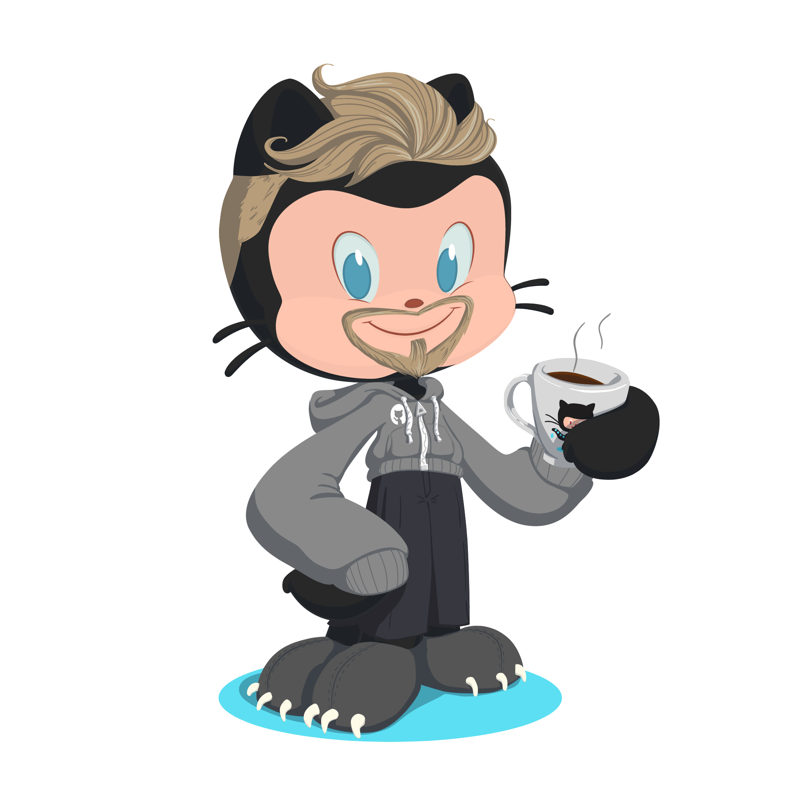
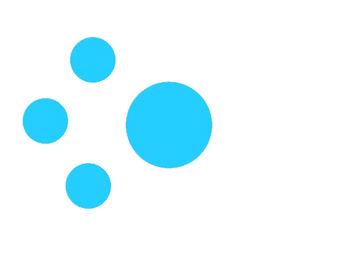

  <h1>Olá eu sou Charles Eduardo</h1>
  

  <h2>:computer: Front-end Developer</h2>

  <h2>:smile:Sou apaixonado por programação e tecnologias, conhecimento é o que me move.</h2>

  <a href="https://github.com/EduardoMG12">
  
  

  <h2>Tecnologias e Ferramentas:</h2>
</h4>
 
&nbsp;

  <!-- javascript -->
  
  <!-- htm5 -->
  
  <!-- css3 -->
  
  <!-- bootstrap -->
  
  <!-- java -->
  
  <!-- React -->
  
 <!-- nodejs -->
  
  <!-- loading... -->
  

&nbsp;

  
  <h2>Contatos</h2>

 
  
  
   

 

 
<b>Visitors Count</b>
  

 
 

  

    
  

