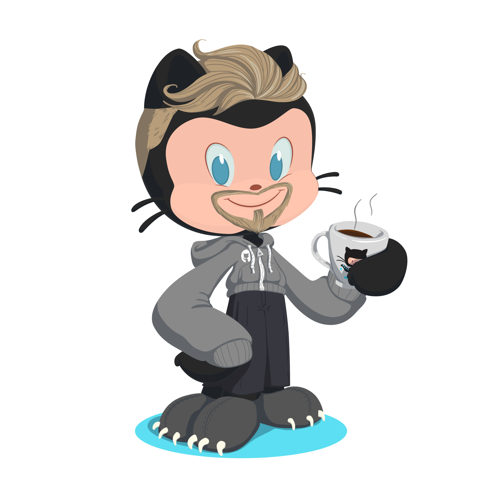

  <h1>Olá eu sou Charles Eduardo</h1>
  

  <h2>:computer: Front-end Developer</h2>

  <h2>:smile:Sou apaixonado por programação e tecnologias, conhecimento é o que me move.</h2>

  <a href="https://github.com/EduardoMG12">
  
  

  <h2>Tecnologias e Ferramentas:</h2>
  
  
  
  
  
  
  
  

  
  <h2>Contatos</h2>

 
  
  
   
  
 
  

 
  

    
  

